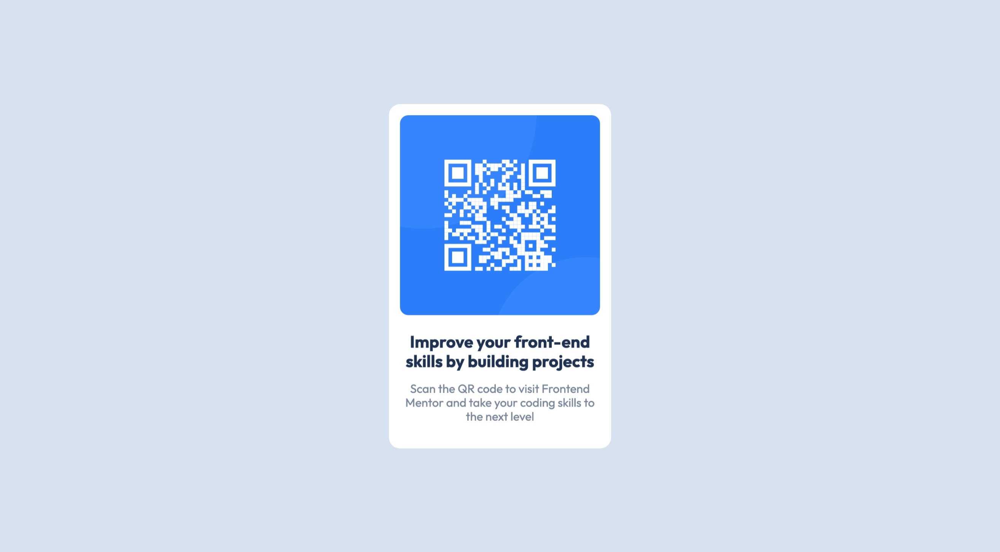

# Frontend Mentor - QR code component solution

This is a solution to the [QR code component challenge on Frontend Mentor](https://www.frontendmentor.io/challenges/qr-code-component-iux_sIO_H). Frontend Mentor challenges help you improve your coding skills by building realistic projects.

## Table of contents

- [Overview](#overview)
  - [Screenshot](#screenshot)
  - [Links](#links)
- [My process](#my-process)
  - [Built with](#built-with)
  - [Build Setup](#build-etup)
- [Author](#author)

## Overview

### Screenshot



### Links

- [Solution URL (GitHub)](https://github.com/isamudev/challenge-qr-code-component)
- [Live Site URL](https://qr-code-component.challenge.isamu.dev)

## My process

### Built with

- Mobile-first workflow
- [Nuxt.js V3](https://v3.nuxtjs.org/) - React framework
- [Tailwin CSS](https://tailwindcss.com/) - For styles

### Build Setup

```bash
# install dependencies
$ yarn

# serve with hot reload at localhost:3000
$ yarn dev

# build for production and launch server
$ yarn build
$ yarn start
```

For detailed explanation on how things work, check out [documentation](https://nuxtjs.org).

## Author

- Website - [isamu.](https://isamu.dev)
- Frontend Mentor - [@isamudev](https://www.frontendmentor.io/profile/isamudev)
- Twitter - [@isamudev](https://www.twitter.com/isamudev)
